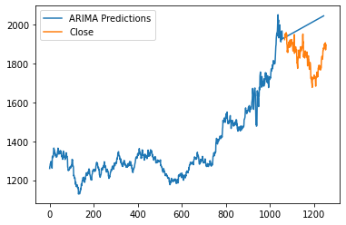

# Gold-Silver-Price-prediction-using-Arima
Gold &amp; Silver Price prediction using Arima, by using historical data.

# Deacription
Autoregressive Integrated Moving Average is a univariate time series forecasting model which,In the ARIMA model the predictor variable consists of lag on Independent variable and the lag of forecasting error

We used the padarima module to find the best order/ parameters for every column/ time series variable.

ARIMA models are great for any ‘non-seasonal’ time series that exhibits patterns and is not a random white noise that can be modeled with ARIMA models.

An ARIMA model is characterized by 3 terms: p, d, q

where,

p is the order of the AR term

q is the order of the MA term

d is the number of differencing required to make the time series stationary

# Results

